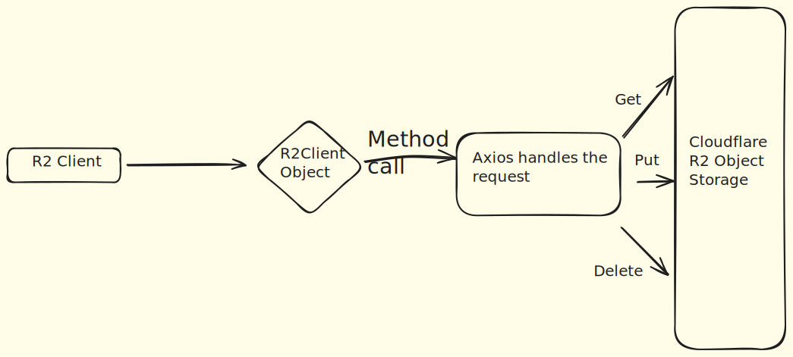

# **Introduction**

Hey Friends! Nice to see you here. This repository consists of the source code for the npm package **cloudflare-r2-s3**. The package is built using Node v22.14.0.The package is filled with classes and various methods associated with the operations one has to perform to interact with CLoudflare's Object Storage i.e **R2**.

R2 is AWS S3 similar cloud storage where you can store your data in the form of Objects linked with a bucket.

Cloudflare provides various API's to interact with R2 in which one of them is S3 compatible(the endpoints and Request format is exactly same as in S3).You can check the complete docs below.

# **Architecture**



# **Docs**

First `require()` cloudflare-r2-s3.

```
const r2 = require("cloudflare-r2-s3");
```

Now we are ready to instantiate a r2Client Object.

```
const r2Client = new r2({ accessKeyId, secretAccessKey, bucket, accountId, host });
```

There is no need to create objects for Get,Put,Delete separately. This single object can handle all of them internally.
Note:- The package currently supports only object level operations i.e get,put and upload as of now.

The list of methods are:-

```
r2Client.getObject(path)
r2Client.getChunk(path, start, end)
r2Client.listObject(prefix)
r2Client.smallUpload(filePath, key)
r2Client.largeUpload(filePath, key)
r2Client.deleteObject(filename)
```

`deleteObject()` is currently unstable and might not work as expected.

All of the above methods are `asynchronous` in nature and requires a `JavaScript Promise` to be reoslved
